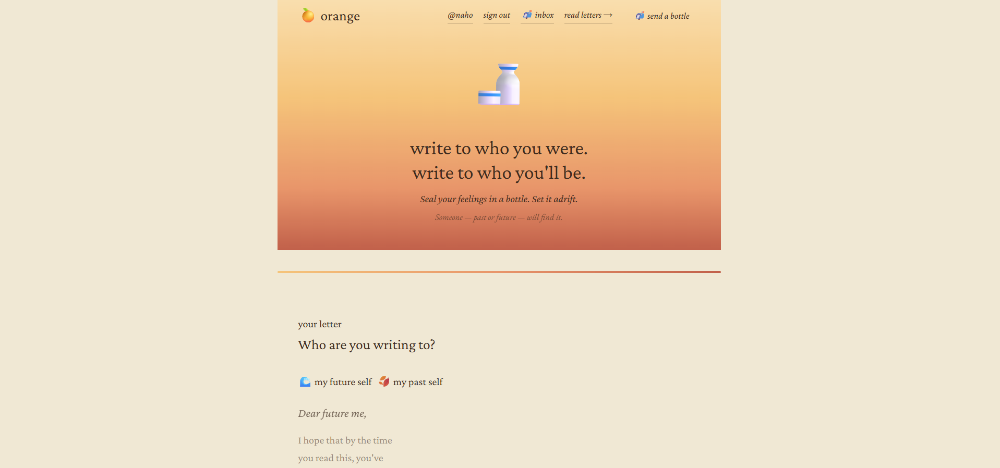
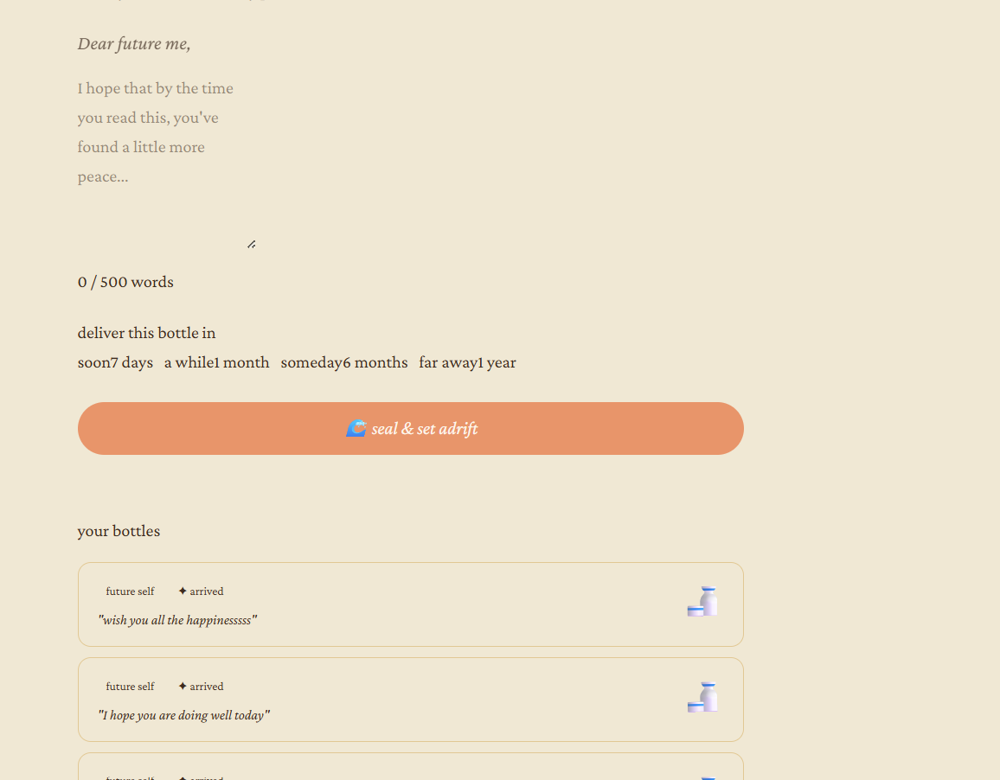
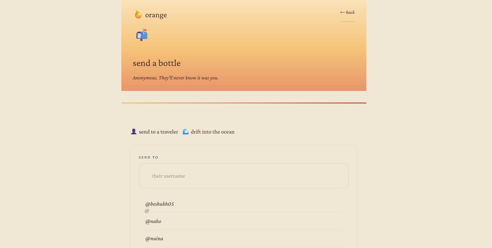

# orange

*write to who you were. write to who you'll be.*


**Live →** [orange-bottles.vercel.app](https://orange-bottles.vercel.app)

---

## What is this?

Orange is a time-capsule web app inspired by the anime *Orange*, where letters
from the future arrive to change the present.

You write a letter, to your past self or your future self, seal it in a bottle,
and set it adrift. It stays hidden until its delivery date. You can either let it
drift anonymously into a public feed, or send it directly to a specific person.

---

## Access model

Orange runs two parallel access modes, chosen per letter:

| Mode | How it works | Auth required |
|---|---|---|
| Drift into the ocean | Bottle joins the public, anonymous feed. Anyone can read it once it arrives. Session tracked via a local, unauthenticated session ID. | No |
| Send to a traveler | Bottle is delivered to one specific recipient by username. Requires signing in via a Supabase passwordless magic link (email → link → choose a username). | Yes |

This split matters architecturally: the app has to support both an authenticated,
identity-aware flow and a fully anonymous one, sharing the same database and the
same time-gating logic underneath.

---

## Features

| Feature | Detail |
|---|---|
| Write a letter | To your past or future self, up to 500 words |
| Seal & set adrift | Choose delivery: 7 days, 1 month, 6 months, or 1 year |
| Magic-link sign-in | Passwordless auth via Supabase, email in, link back, pick a username |
| Send to a traveler | Deliver a letter directly to a specific username |
| Anonymous feed | Drift a letter into the public feed with no login at all |
| Time-gated feed | Bottles only appear after their `visible_at` timestamp, meant to be enforced in the database, not the client |
| Reactions | React to bottles you've read |
| My Journey | Track your own drifting bottles with live countdowns |
| Orange aesthetic | Amber skies, parchment cards, Playfair Display typography |
| Responsive | Works on mobile and desktop |

---

## Tech stack

```
Frontend    React 18 + Vite
Styling     Tailwind CSS + custom CSS design system
Animations  Framer Motion
Backend     Supabase (PostgreSQL + Row Level Security)
Auth        Supabase Auth, passwordless magic link (for targeted delivery)
            + anonymous session IDs via localStorage (for public feed)
Hosting     Vercel
```

---

## Architecture

```
React frontend (Vite, on Vercel)
        |
        |-- Anonymous session --------.
        |   (no login)                |
        |                             v
        `-- Magic-link auth ----> Supabase client (api.js)
            (email -> link ->         |
             choose username)         v
                            PostgreSQL database
                            Bottles table + RLS policies
                            (only visible after visible_at)
```

---

## Database & security

- Bottles are stored in a single Postgres table with a `visible_at` timestamp.
- I designed and tested Row Level Security policies directly against the database
  to enforce that a bottle is only readable once `visible_at <= now()`, independent
  of the frontend.
- Current status: time-gating is enforced at the application layer right now while
  I sort out a Supabase platform issue with API access under RLS. I've confirmed the
  policy logic itself is correct through direct SQL testing, production enablement
  is still pending.
- Anonymous writes use a locally generated session ID; authenticated writes are
  tied to the signed-in user's ID from Supabase Auth.

---

## Screenshots

| Home, write a letter | Your bottles / feed | Send to a traveler |
|---|---|---|
|  |  |  |

---

## Project structure

```
src/
├── components/
│   ├── Bottle.jsx          # Floating bottle animation
│   ├── BottleCard.jsx      # Feed card with reactions
│   ├── MyBottles.jsx       # Countdown tracker
│   ├── PageWrapper.jsx     # Route transition wrapper
│   └── WriteLetter.jsx     # Letter writing + seal flow
├── pages/
│   ├── Home.jsx            # Landing + write page
│   ├── Feed.jsx             # Browse arrived bottles
│   └── MyJourney.jsx       # Your bottles, drifting + arrived
├── lib/
│   ├── api.js              # All Supabase queries
│   ├── myBottles.js        # localStorage bottle tracking (anonymous mode)
│   ├── session.js          # Anonymous session UUID
│   └── supabase.js         # Supabase client + auth
├── hooks/
│   └── useIsMobile.js
└── styles/
    └── orange.css          # Full design system
```

---

## Running it locally

```bash
git clone https://github.com/ruchigupta22/orange-bottles.git
cd orange-bottles
npm install

# create a .env file
echo "VITE_SUPABASE_URL=your_url" >> .env
echo "VITE_SUPABASE_ANON_KEY=your_key" >> .env

npm run dev
```

---

## Design notes

The visual identity is built around a few ideas from the anime:

- Amber horizon: a gradient bar that runs between every section, meant to feel like
  the golden-hour sky in the show
- Parchment & ink: letter surfaces use warm cream tones, body text uses Crimson Pro
  italic to feel handwritten
- Quiet animation: bottles float, reactions ripple, nothing shouts for attention

---

## What's next

- Email nudge when your bottle arrives (Supabase Edge Function + Resend)
- A drifting-bottle visualization on the feed
- Share a specific bottle via link
- Dark mode (night sky palette)

---

## License

MIT, see [LICENSE](./LICENSE)
